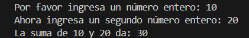
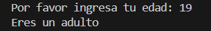
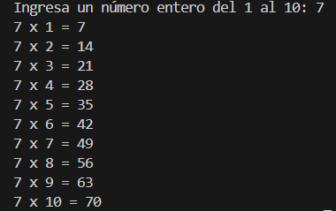
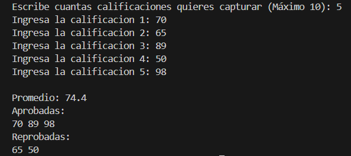
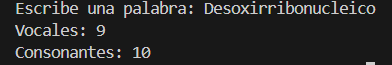

# Lista de los ejercicios realizazos
[Volver al inicio](../README.md)
## Ejercicio 1
### Descripción
Este es un programa que le pide al usuario dos números enteros, se valida que estos efectivamente sean enteros y después de eso los suma y muestra el resultado.
### Código
```java

import java.util.InputMismatchException;
import java.util.Scanner;

public class Ejercicio1 {
    public static void main(String[] args) {
        Scanner sc = new Scanner(System.in);
        
        int n1 = 0;
        int n2 = 0;

        while(true) {

            try {
                System.out.print("Por favor ingresa un número entero: ");
                n1 = sc.nextInt();
                break;

            } catch (InputMismatchException e) {
                System.out.println("Ese no es un número valido, por favor intenta otra vez\n");
                sc.nextLine();
            }
        }

        while(true) {

            try {
                System.out.print("Ahora ingresa un segundo número entero: ");
                n2 = sc.nextInt();
                break;

            } catch (InputMismatchException e) {
                System.out.println("Ese no es un número valido, por favor intenta otra vez\n");
                sc.nextLine();
            }
        }

        int result = n1 + n2;
        System.out.println("La suma de " + n1 + " y " + n2 + " da: " + result);
    }
}
```
### Entrada y salida

## Ejercicio 2
### Descripción
En este programa se pide la edad al usuario, y en base a cuantos años ponga, se pone un mensaje personalizado.
### Código
```java
import java.util.InputMismatchException;
import java.util.Scanner;
public class Ejercicio2 {
    public static void main(String[] args) {
        Scanner sc = new Scanner(System.in);

        while(true) {
            
            try {
                System.out.print("Por favor ingresa tu edad: ");
                int age = sc.nextInt();

                if (age < 13) {
                    System.out.println("Eres un niño");
                } else if (age < 18) {
                    System.out.println("Eres un adolescente");
                } else if (age < 65) {
                    System.out.println("Eres un adulto");
                } else {
                    System.out.println("Eres un adulto mayor");
                }

                break;
                
            } catch (InputMismatchException e) {
                System.out.println("Lo que ingresaste no entra dentro de lo que se te solicito, por favor intenta de nuevo\n");
                sc.nextLine();
            }
        }
    }
}
```
### Entrada y salida

## Ejercicio 3
### Descripción
En este programa se le pide al usuario un número entero del 1 al 10, y se muestra la tabla de multiplicar del 1 al 10 del número elegido.
### Código
```java
import java.util.InputMismatchException;
import java.util.Scanner;
public class Ejercicio3 {
    public static void main(String[] args) {
        Scanner sc = new Scanner(System.in);
        
        while(true) {

            try {
                System.out.print("Ingresa un número entero del 1 al 10: ");
                int n = sc.nextInt();

                if (n < 1 || n > 10) {
                    System.out.println("El número debe de estar entre 1 y 10, por favor intenta de nuevo\n");
                    continue;
                }

                for (int i = 1; i <= 10; i++) {
                    System.out.println(n + " x " + i + " = " + (n*i));
                }

                break;

            } catch (InputMismatchException e) {
                System.out.println("Ese no es un número entero válido, por favor intenta de nuevo\n");
                sc.nextLine();
            }
        }
    }
}
```
### Entrada y salida

## Ejercicio 4
### Descripción
En este programa se le pide al usuario cuantas calificaciones quiere capturar, que son máximo 10, y en base a eso pide el valor de cada una, con lo que se saca el promedio y se indican cuales materias se reprobaron y cuales se aprobaron en base a 70 como calificación aprobatoria.
### Código
```java
import java.util.InputMismatchException;
import java.util.Scanner;

public class Ejercicio4 {
    public static void main(String[] args) {
        Scanner sc = new Scanner(System.in);
        int ngrad = 0;

        while(true) {
            try {

                System.out.print("Escribe cuantas calificaciones quieres capturar (Máximo 10): ");
                ngrad = sc.nextInt();

                if (ngrad < 1 || ngrad > 10) {
                    System.out.println("El número de calificaciones debe esta entre 1 y 10, por favor intenta de nuevo\n");
                    continue;
                } 
                break;

            } catch (InputMismatchException e) {
                System.out.println("Ese no es un valor válido, por favor intenta de nuevo\n");
                sc.nextLine();
            }
        }

            int[] grades = new int[ngrad];
            int addition = 0;

            for(int i = 0; i < ngrad; i++) {
                while(true) {
                    try {
                        System.out.print("Ingresa la calificacion " + (i + 1) + ": ");
                        int grad = sc.nextInt();

                        if (grad < 0 || grad > 100) {
                            System.out.println("La calificación debe esta entre 1 y 100\n");
                            continue;
                        }

                        grades[i] = grad;
                        addition += grad;
                        break;


                    } catch (InputMismatchException e) {
                        System.out.println("Valor inválido, por favor igresa un número entero\n");
                        sc.nextLine();
                    }
                }
            }

            double average = (double) addition/ngrad;

            System.out.println("\nPromedio: " + average);
            
            System.out.println("Aprobadas: ");
            for (int grad : grades) {
                if (grad >= 70) {
                    System.out.print(grad + " ");
                }
            }
            System.out.println();

            System.out.println("Reprobadas: ");
            for (int grad :grades) {
                if (grad < 70) {
                    System.out.print(grad + " ");
                }
            }
            System.out.println();
    }
}
```
### Entrada y salida

## Ejercicio 5
### Descripción
### Código
```java
import java.util.Scanner;
public class Ejercicio5 {
    public static void main(String[] args) {
        Scanner sc = new Scanner(System.in);

        String word;
  
        while(true) {

            System.out.print("Escribe una palabra: ");
            word = sc.nextLine();

            if(word.matches("[a-zA-Z]+")) {
                break;
            } else {
                System.out.println("Debes ingresar solo letras, por favor intenta de nuevo");
            }
        }

        word = word.toLowerCase();

        int vowels = 0;
        int consonants = 0;

        for (int i = 0; i < word.length(); i++) {
            char c = word.charAt(i);

            if (c == 'a' || c == 'e' || c == 'i' || c == 'o' || c == 'u') {
                vowels++;
            } else {
                consonants++;
            }
        }
        
        System.out.println("Vocales: " + vowels);
        System.out.println("Consonantes: " + consonants);
    }
}
```
### Entrada y salida
